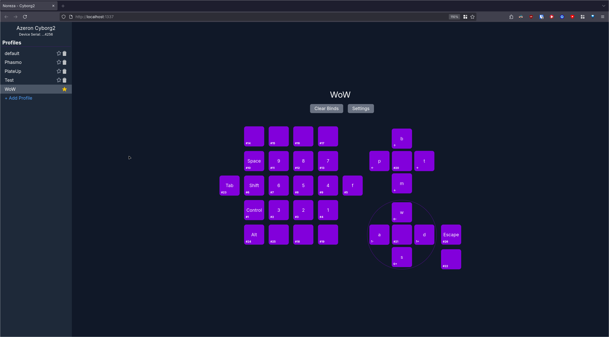
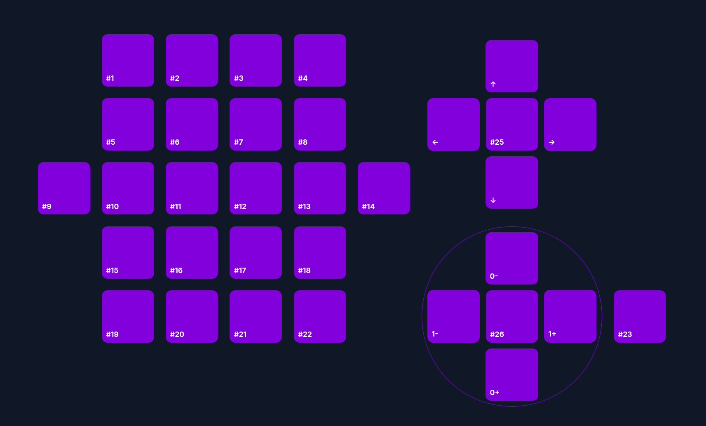
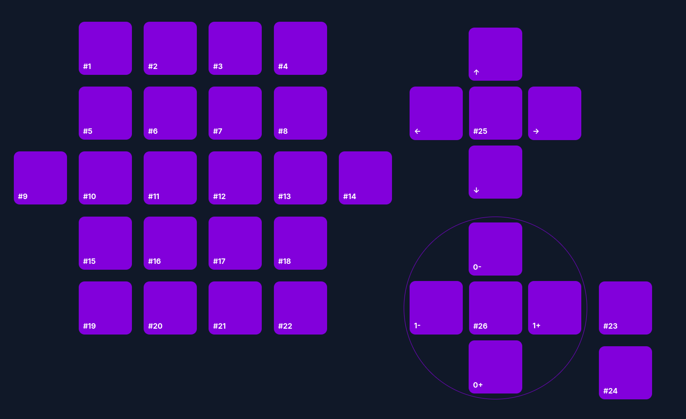
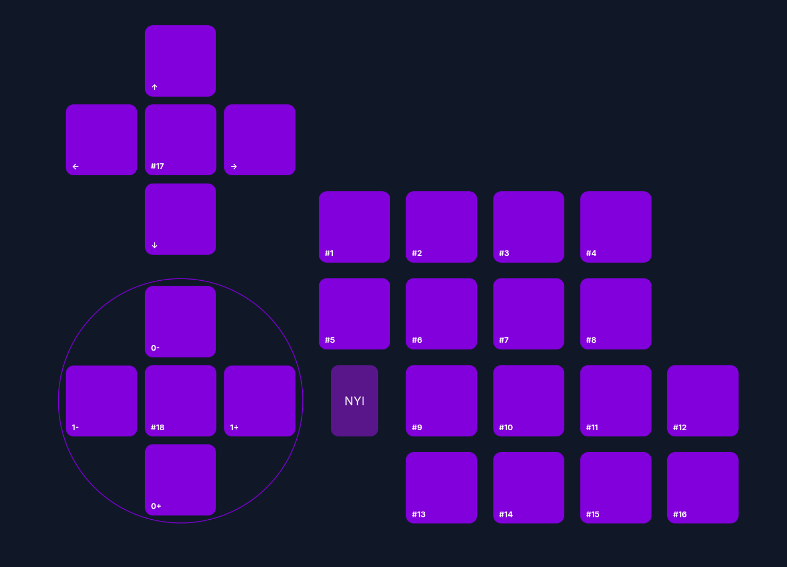
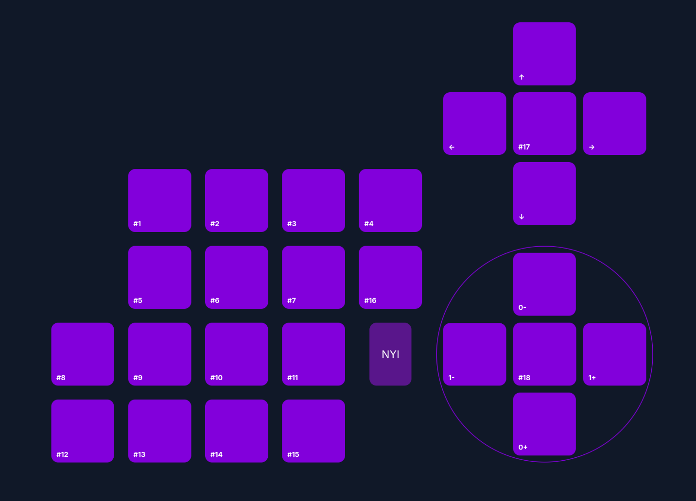
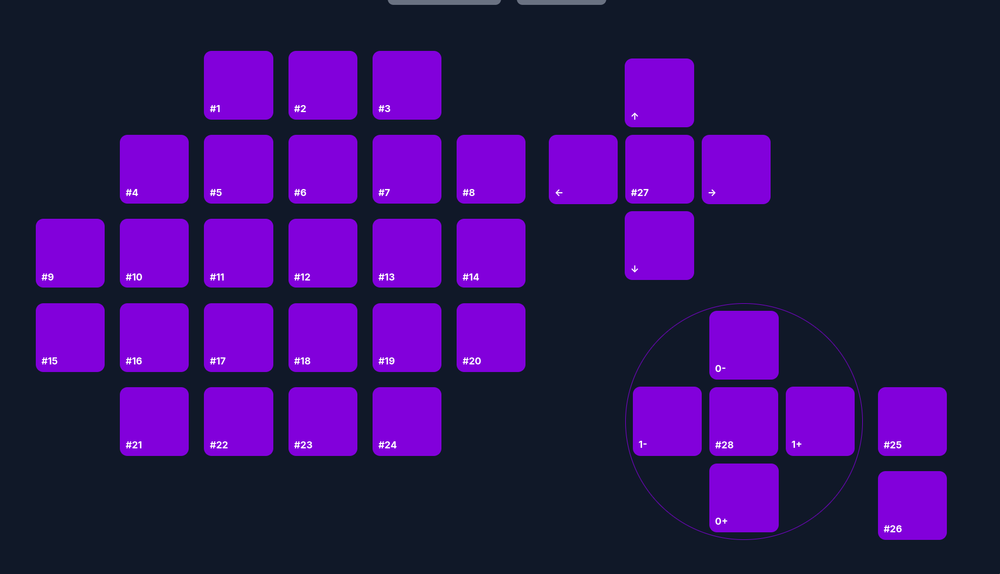

# Noreza
### A (unofficial) dedicated mapper for Azeron devices on Linux

## Currently Supported Devices
- Classic
- Cyborg 1
- Cyborg 2
- Cyro
- Cyro (Lefty)
- Keyzen

## Features
- Web interface
- Visualize key presses and analog joystick
- X11 Auto Profile Switching
- Option to visually mirror layout for opposite hand devices

Preview

## Requirements
- uinput access (user in input group)
- Azeron device joystick set to analog, all buttons set to joystick buttons, and hat set to joystick dpad up, down, left and right

### Required Azeron Hardware Profiles  
\* Number in bottom left of key should be which JOY key is assigned.  
\* Joystick MUST be set to "Analog Joystick".  
\* Any not listed can be found by viewing in the web browser

Cyborg1

Cyborg2

Cyro

Cyro (Lefty)

Keyzen

## Instructions
- Get serial of Azeron device (`lsusb -d 16d0: -v | grep iSerial`)
- `noreza --serial <SERIAL>`
    - If your device does not have a serial or it shows as 0, you can pass the product id instead `noreza --product-id 0x12f7`
    - It is the 2nd segment of lsusb, e.g. `16d0:12f7`
- You can pass `--wait` to have the program wait for a matching device to be connected
- Access the web interface at localhost:1337 (port can be changed with `--port`)
