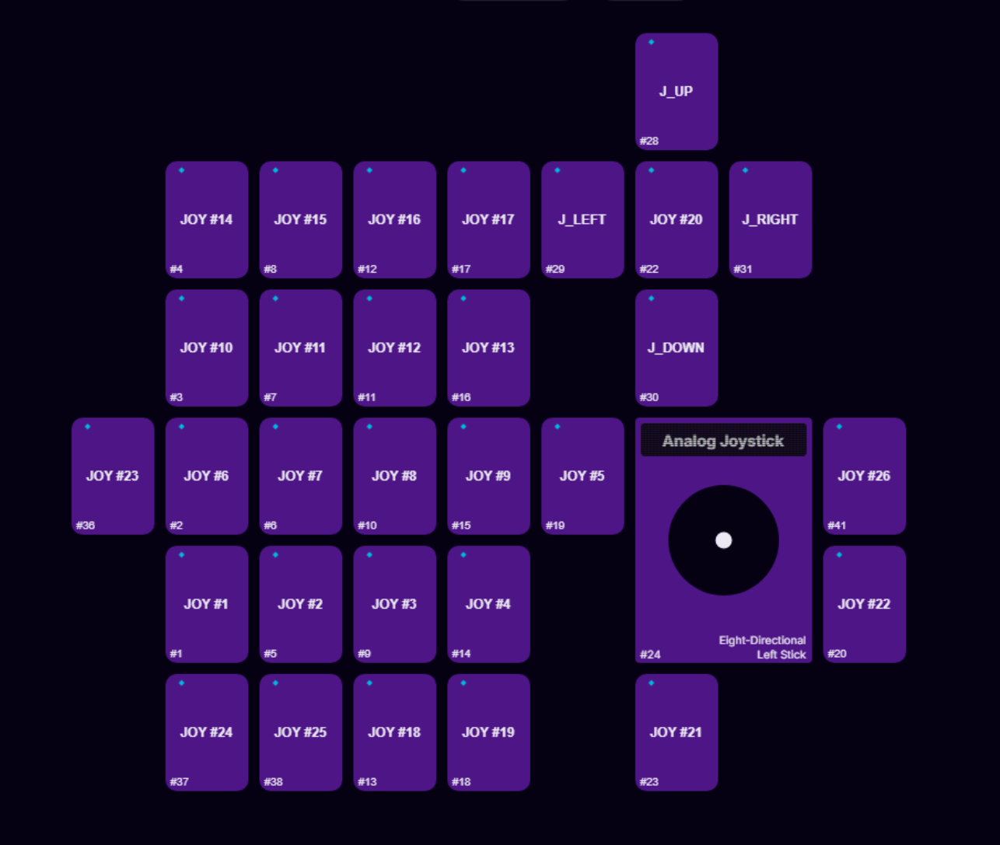

# Noreza
### A (unofficial) dedicated mapper for Azeron devices on Linux

## Currently Supported Devices
- Cyborg 2

## Features
- Web interface
- Visualize key presses and analog joystick
- X11 Auto Profile Switching

Preview

## Requirements
- uinput access (user in input group)
- Azeron device joystick set to analog, all buttons set to joystick buttons, and hat set to joystick up, down, left and right

Required Azeron Hardware Profile

## Instructions
- Get serial of Azeron device (`lsusb -d 16d0: -v | grep iSerial`)
- `./noreza --serial <SERIAL>`
- Access the web interface at localhost:1337 (port can be changed)

## Tips:
- A udev rule might be useful to start the process on device connect (process stops if device disconnects)

# TODO:
- Hardware Profiles
